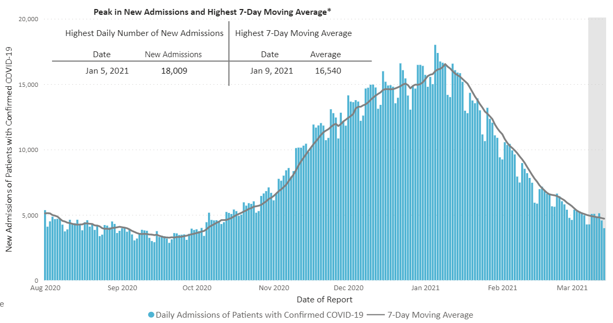
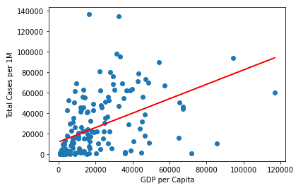
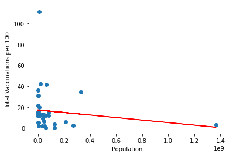
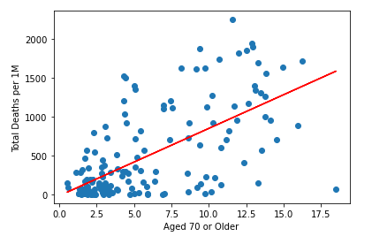

# Covid-19 Regression Analysis

## Roster
The team members of this project include: Akshaya Kamble, Ray Hunt, Thomas Watson, and Tyler Engalla.

## Problem Statement
Covid-19 is a global pandemic resulting in death, econmoic pressures and the shutdown of travel in many parts of the world. Fortunately, vaccines are being made available to innoculate populations against Covid-19 and reduce the virus' opportunity to mutate.

Throughout 2020, we saw new daily confirmed patients into hospitals soaring as high as 18,000 new patients per day. Shortly after Covid-19 vaccinations became public, we began to see the number of covid confirmed patients fall significantly: 

Aside from vaccine avialability, what factors impact the vaccination rate of a given country? Does a country's GDP improve its vaccination rate? What impact does population demographics have on a country's vaccination rate? Upon understanding these factors, can we predict a country's vaccination rate? 

We will analyze how certain attributes such as  Gross Domestic Product (GDP), Human Development Index (HDI), and population directly impact the spread of Covid-19 and the vaccination rate.

## Initial Analysis
In the first week of the project, we had to make decisions on which technologies would be used to help us analyze Covid-19 data. 

For the final project we have selected Supervised Machine learning because the the input data is known (Gross Domestic Product, Human Development Index, population and demographic data) and a desired output (vaccination rate). We selected a Linear Regression model to analyze data from Covid Vaccinations and GDP of all countries because it provides us with predictive capabilities instead of a classification model.

Using continuous data we will identify the relation between data and make predictions regarding the vaccination rate for a country. A diagram of our linear regression thought process [Link is here][4]

Using quickdatabasedesigns.com we created a conceptual design for our mockup database that includes two tables. The first is the master_country table that stores the following columns iso_code (primary key), country_name, population, gdp. The second table will store the vaccination data by country. The results of our conceptual diagram [Link is here][5]

Plotting pairplots using seaborn library to check relations between our dependent and independent variables, this can help determine which variables can be used for machine learning. [Link is here][10]

## Technologies Used
The technologies used are as follows:

1) Data Cleaning and Analysis -
Jupyter Notebook and the Pandas library will be used to clean the data and perform an exploratory analysis. Further analysis will be completed using Python. Jupyter was selected because of the team's familiarity with the tool. Python was chosen because of its  libraries for data ingestion and analysis such as Pandas and the ease of creating Machine Learning models using SKLearn as well as visualization capabilities in MatPlotLib.

2) Database Storage -
Postgres is the database used. It is easy to implement and run MySQL querries. We decided against AWS RDS because of the associated costs and several team members had alreacy cancelled their accounts.

3) Machine Learning -
SciKitLearn is the ML library we'll be using to create a linear regression. We'll train our algorithm with a histocal dataset on Covid Vaccinations and GDP of all countries.

4) Dashboard -
We created a web enabled dashboard using JavaScript, HTML, and CSS with the Plotly visualization library to build an interactive webpage hosted in GitHub Pages. In addition, we will include the D3 library to visualize our data geographically. A webpage was unanimously agreed upon because of ease of display without a user having to install Tableau or PowerBI.

## Project outline
A flow chart to represent the project working

## Data Sources and Description

The data used in this project are included in the links below:

1. CDC Link: https://covid.cdc.gov/covid-data-tracker/#datatracker-home 
2. Kaggle Data: https://www.kaggle.com/gpreda/covid-world-vaccination-progress
3. World Bank Data: https://data.worldbank.org/indicator/NY.GDP.MKTP.CD
4. Our World In Data: https://github.com/owid/covid-19-data/tree/master/public/data
5. UNDP data for hdi : http://hdr.undp.org/en/data

These five data sources have been chosen based off accuracy, their input type, and completeness. Descriptions of our files are included below.

1. country_gdp - This file from world bank has GDP for all countries starting from year 1960 to 2019, since we are using covid-19 data for the project we will use gdp from the year 2019.

2. country_vaccinations - This file from kaggle has vaccination data for all countries along with dates, as the vaccinations are still 
in progress some countries have advanced towards some small percent of population considered fully vaccinated while some countries no not have any data.

3. world_population - This file from world bank has populations for all countries from year 1960 to 2019. As per project requirements we have used data only for the year 2019.This data is added to the gdp data file.

4. human_dev_index - This file from UNITED NATIONS DEVELOPMENT PROGRAMME has human development index(HDI) for all countries along with Human Development Type which are required for the project

5. Infection_Data - This file from github repository has updated data from Our World in Data.This file has data about the infections rates,deaths, new case,hospitalization rate, testing dates for different countries.We have filtered the dataset as per project requirements and included data like total cases and total deaths.  

## Description of Data Exploration Phase

### Looking at our datasets

- The below datasets were downloaded in March 2021 and will be used as a static data for the project
- 5 Data sets are downloaded from the websites in csv and excel formats
- 5 Data sets cleaned in Jupyternotebook
- 3 different joins will be done in Postgres database
- 150 Countries are available in the country_vaccinations Dataset which have information about vaccinations at different dates and stages
- The country_gdp dataset has GDP for 265 countries and territories, and we will use data for only 2019
- The human_dev_index dataset has HDI for 196 countries and territories, and we will use data for only 2019
- The world_population dataset has population data for 265 countries,and we will use data for only 2019 
- The Infection_Data dataset has infection data for 213 countries
- After the basic clenaing we have 67 countries that can be used for the machine learning model
- 82 Countries have information for people fully vaccinated, but this is a very small percent just 0.2%
- 150 Countries have received vaccinations as per country_vaccinations dataset
- 138 Countries have people vaccinated, which means they have received atleast some quantities of the first dose
- A lot of countries have no information for us form the dataset country_vaccinations, we see that no vaccinations were received, if vaccinations were received they were not administered and in some cases there is absolutely no information for some countries.The Probable reason could be that these countries do not have any means to record data or no proper medical guidance and facilities
- 44 countries received vaccinations but no future progress recorded is available.

### The following methods can be implied for making the data ready for machine learning model

- Checking Data Types  
- Replace NaN by 0  
- Removing Nan  
- Outlier detection with help of scatter plot  
- Editing column names by removing spaces  
- Changing column names to match the SQL schema  
- Filter required columns as some tables contain irrelevant data for project  

## Description of the Analysis Phase
As data cleaning is the primary requirement for getting a perfect machine learning model we have incorporated the following methods for cleaning data in the individual files.For the project our main focus was to obtain data for GDP,HDI,population and people fully vaccinated for each country so that we can find relations between the data we have.Before sending the data to machine learning the data was cleaned, sent to postgres for storing and joining data as required.The data will help us determine the relation between HDI vs Total cases per million, HDI vs Population,GDP per Capita vs Total Cases per Million,Population Density vs Total Cases per Million,Median Age vs Total Deaths,Aged 70 or older vs Total Deaths,GDP vs Vaccination Rates,HDI vs Vaccincation Rates.
In some columns the null values are droped because we require data for the respective countries and in some columns the null values were replaced by 0 as the model will not work with null values and 0 can be usefull in some cases.The column names were changed in some files to match the exact column name in other files as these are required for joining data in postgres.The required columns are kept and some unwanted were deleted,Outliers were determeined by plotting scatter plots and chaging the axis range accordingly.

The below file have details about the tranformations done individually.

1. country_gdp
This file is downloaded from the worldbank.The NaN are replaced by 0, the column names are changed to match the schema in SQL, deleting columns and keeping only required columns.Saving the file country_master.csv to Cleaned Data folder.

2. country_vaccinations
This file is downloaded from kaggle. Dropping the NaN data as we need countries with available data only,changing names of columns to match schema in SQL,deleting columns and keeping only required columns,Saving the file vaccination_table.csv to Cleaned Data folder.

3. world_population
This file is downloaded from world bank.The only required data of population from 2019 is saved into country_master.csv using vlookup. 

4. human_dev_index
This file is downloaded from UNITED NATIONS DEVELOPMENT PROGRAMME.Changing names of columns to match schema in SQL, droping rows with null values.Saving the file human_dev_index.csv to Cleaned Data folder.

5. Infection_Data
This file from github repository has updated data from Our World in Data.Filtered data with date,changing names of columns to match schema in SQL,dropping null values.Checking outliers using scatter plot.Saving the file as Infection_Clean.csv to Cleaned Data folder 

## Machine Learning Model

We are trying to find the relationship between two or more continuous variables. In our case, how does GDP, HDI, and Population have an impact on Covid Vaccination Rates and Infection Rates. 

We chose a supervised machine learning model because our data has labels (this is GDP, HDI, Population) and it’s learning based on those input values what the output of Covid Vaccination Rate and Infection Rate might be. 

Linear Regression analysis is a reliable method of identifying which variables have an impact on our topic of interest and gives us the ability to easily visualize that relationship with scatter plots and a best fit line. 

This model allows us to confidently determine which of these factors (GDP, HDI, Population) had the biggest impact, or had the largest influence on our dependent variables (Covid Vaccination Rates and Infection Rates).

To check all these variables we ploted pairplots to help us choose variables for machine learning model  
### Pairplot for gdp_vaccination_hdi dataset

### Pairplot for infection_data

### Data preprocessing 
- Acquired Datasets for Vaccinations, GDP, Infections, and HDI 
- Imported Pandas , sklearn, matplotlib.pyplot, hvplot.pandas, statsmodels.api
- Imported the dataset that has gone through our ETL process
- Drop any null values still in the data. We only want countries that have statistics for everything we want to test for.
- Kept only columns that we were wanting to perform regression analysis on 

### Feature engineering and the feature selection
For the Vaccination Data, we started by joining the Vaccination table with the GDP table on “country_name”. There were multiple months of dates, but we only needed one to perform the regression analysis. So we filtered to get the date that gave us the most countries tied to it with the least amount of null values across the features. Then we wanted to select the feature that gave us an idea at the rate countries were getting vaccinated, so we took “total_vaccination_per_hundred” and regressed it against other features such as GDP, HDI, Life Expectancy at Birth, and Population. We scaled the data, but found it wasn’t necessary for our regressions to take place or didn't add noticable optimization. 

### How data was split into training and testing sets
- Initially for our Regression Analysis, there wasn’t a need to split the data for training and testing sets. 
- However, we did split the data into our independent and dependent variables to see how one features affects or how correlated it is with the other. 
- Vaccination Rates was chosen as our dependent feature or data set, and GDP, HDI, and Population were chosen as our main independent features to see how they each affected     Vaccination Rates. 
- For the linear regression (GDP vs people_fully_vaccinated )we tried the random state for splitting and have r^2 score of 54% and variance as 60%
- For the linear regression (GDP vs people_vaccinated )we tried the random state for splitting and have r^2 score of 68% and variance as 70%
- For the multi linear regression ( GDP, population and HDI vs people_vaccinated) we tried the random state for splitting and have r^2 score of 69% and variance as 73%

### Model choice, including limitations and benefits

Limitations with this model would be around outliers having a huge effect that that skews our findings. As well, we’re only comparing two variables against each other at a time. So this gives us of an idea of the relationship between the two but it’s not a complete picture of the relationship and what else might be impacting it.

### Changes in model choice
Since we see a relation between our independent and dependent variable we continue to use Linear regression for the project

### How model was trained
We considered training data with single and multiple variables. Also changed the train test ratio. The following models below have the best scores for r2 values and variance.
The best model was GDP,Population, HDI rank vs people vaccinated with test_size=0.2 which gave r2 score 70% and variance 73%. The python file for machine learning[Link is here][11]

- GDP vs People_vaccinated r2 score 68% and variance 70%
- GDP,Population vs people vaccinated r2 score 69% and variance 73%
- GDP,Population, HDI rank vs people vaccinated r2 score 69% and variance 73%
- GDP,Population, HDI rank vs people vaccinated with test_size=0.2 r2 score 70% and variance 73%

### Model’s confusion matrix, including final accuracy score 
With the linear regression and the type of independent and dependent variables we are not able to generate the confusion matrix.
The best score for the model GDP,Population, HDI rank vs people vaccinated with test_size=0.2 r2 score 70% and variance 73%

## Database Integration

### The following process is used for connecting different platforms and data transition in the project.

1. Once the data is cleaned and analyzed in Jupyter notebook it is ready for the machine learning model
2. A database connection is made from Jupyter notebook to postgres using SQLAlchemy
3. Once the connection is established the data is sent to the database, we send 5 datasets
4. The data is stored in the database
5. The data is then joined in postgres, we have 3 joined tables
6. Then a new database connection is made from postgress to Jupyter notebook using SQLAlchemy
7. These joined tables are then moved back to jupyter notebook
8. Once these joined tables are available in Juypyter notebook, the maching learning starts here

### Below is a detailed description about the datasets in each phase of data integration

The following files are downloaded from the websites and cleaned in Jupyter notebook for the project. The population data for 2019 is added to the country_gdp.csv file using VLOOKUP. All these files are available in the [Resources folder][1]

1. country_gdp.csv
2. country_vaccinations.csv
3. human_dev_index.csv
4. Infection_Data
5. world_population.csv

The cleaned data files are sent from jupyter notebook using Pandas and Python libraries psycopg2 and sqlalchemy to pgadmin. All the cleaned data files are available in the [Cleaned Data folder][2]

1. country_master.csv
2. vaccination_table.csv
3. human_dev_index.csv
4. Infection_Clean.csv

The Database stores static data that is sent from Jupyter notebook. The following files are stored in the pgadmin Database as tables. 

1. country_master
2. vaccination_table
3. human_dev_index
4. Infection_clean

Here is the ERD which shows how the tables are connected in the database. 

A single query is used to create a new table that is the result of joining other two tables using inner join and primary keys.
[Link to SQL Query][6]

The following tables are created by joining the data from the above files
1. gdp_vaccination_join [Link to pgadmin][7]
2. gdp_vaccination_hdi [Link to pgadmin][8]
3. country_group [Link to pgadmin][9]

These joined tables are sent to jupyter notebook using Pandas and Python libraries psycopg2 and sqlalchemy to use further for machine learning.Snapshots of Database integration are available in the [Database Integration folder][3]

## Visualizations and Storyboard

Portraying results is important because it brings weight to our analysis. Images, interactive figures, Github, and Google Slides are all powerful tools which can help us share our findings to the masses. 

The first aspect of the Covid-19 analysis we were interested in reviewing was how case count stacked up against Countries GDP. We predicted that as GDP increased in countries total cases would decrease. We thought this would be the case because countries with more money would have access to better vaccines, masks, and hospital equipment. However, when we graphed it out the results showed the exact opposite! In fact, case counts per million rises substantially as GDP increases. We think these results might have been caused by countries with lower GDP not reporting cases or trading interactions substantially increase as GDP increases for a country.

This visualization gives us insight on the amount of vaccinations given to a particular country in comparison to their population. As you can see in certain countries, more shots have been administered than the total population size. Often times, lower population also correlates to a lower total country GDP. For this reason, as the slope of the line of this graph suggests, people may actually be safer in countries with a smaller population. This graph gives us insight into the graph we saw before about GDP vs. case count. Smaller and countries with a lower GDP may actually be a safer place to live!

One of the things we were quite interesting in exploring during this project was the relation between age and death rates. We believed the older the individual, the more likely you were to die of covid. To put this assumption to the test, we created a graph which shows how each year over 70 dramatically increases your chance of dying from covid. As you can see from the graph on the right, the slope of deaths per million people is pretty steep (around 85 more deaths per million each year over 70). 

Setting the stage for what we hope to accomplish by the end of the project, we will be setting forth a blueprint with a description of our elements of what we hope to achieve. These ideas are shown below.

In the Storyboard we plan to use the following visualizations to add value to our final project.

1) World Map - Our first chart will be an interactive map of the world with data for select countries. Based on filter selection, a tooltip will appear on hover-over to display that country’s name, population and  GDP, Health Data Index or total vaccinations rate.

2) Bubble Chart - A drop-down menu will let the user select the top 10 countries by GDP,  bottom 10 countries by GDP or all countries. When the selection is made the bubble chart will update displaying countries as bubbles. The Y axis is population, the X axis is GDP and the size of the bubble is determined by total vaccinations per hundred.

3) Heatmap -Another interesting idea we had was with heatmaps are trying to illustrate the covid hotspots throughout the world. This would be based on Covid-19 cases caught in a certain density.

4) Finally, we will use static images of ML results to demonstrate the output of our ML models.

What tools will be used to create this dashboard?
- For this project we plan to integrate several tools to create these visualizations. For the majority of the project we have been using Python to sift through our data. Therefore, it makes sense for us to create crisper images with Seaborn for a better user experience. In addition, for the world map we were thinking of using GeoJSON to make it an interactive experience with our user. These are steps we plan to integrate in the next several weeks.

## Dashboard
Please visit our dashboard to review our analytic and Machine Learning results:
[Dashboard Link](https://tpw429.github.io/Covid-19_Regression_Analysis/)

### The dashboard is built using the following technologies
- HTML
- Python Libraries -plotly,hvplot,matplotlib
- Javascript Libraries - Leaflet and D3.js
- The dashboard is deployed on GitHub Pages

### Interactivity of our Dashboard

- Initial Analysis image available in drop down menu.
- Images of the initial analysis is available in the drop down menu along with other list items.
- Interactive drop down menu pulls titles (GDP,HDI,HDI rank,Life Expectancy and Population) from a list
- After selection of a menu item, the respective image is displayed below.
- Information about the drop down menu items is displayed in a paragraph below the image.
- Next below we have an Interactive map
- Map displays information about people fully vaccinated with different color and size cirles plotted on each country.
- A pop up displays country and population
- An index of the population range is available on the down right corner
- The map can toggle between street and dark view
- Right now we have only one feature (people fully vaccinated) seen on the map, but for future we can add more features for selection.

Below we have included a link to our google slides and the original powerpoint is available for speaker notes as part of submisssion. The google slides have the speaker notes included in the comment section for each slide. [Link is here][12]
### [Google Slides Covid-19 Regression Analysis Presentation](https://docs.google.com/presentation/d/1JQeOwovcKA4-0dyTTak2V6hE9sy4mft0BnIYaICz5B4/edit?usp=sharing)

[1]: https://github.com/Tpw429/Covid-19_Regression_Analysis/tree/main/Resources

[2]: https://github.com/Tpw429/Covid-19_Regression_Analysis/tree/main/Cleaned%20Data

[3]: https://github.com/Tpw429/Covid-19_Regression_Analysis/tree/main/Database_Integration

[4]: https://github.com/Tpw429/Covid-19_Regression_Analysis/blob/main/Resources/Linear_Regression.PNG

[5]: https://github.com/Tpw429/Covid-19_Regression_Analysis/blob/main/Resources/QuickDBD_vaccination.PNG

[6]: https://github.com/Tpw429/Covid-19_Regression_Analysis/blob/main/Database_Integration/queries_for_SQL.txt

[7]: https://github.com/Tpw429/Covid-19_Regression_Analysis/blob/main/Database_Integration/create_table_gdp_vaccination_join.PNG

[8]: https://github.com/Tpw429/Covid-19_Regression_Analysis/blob/main/Database_Integration/create_table_gdp_vaccination_hdi.PNG

[9]: https://github.com/Tpw429/Covid-19_Regression_Analysis/blob/main/Database_Integration/create_table_country_group.PNG

[10]: https://github.com/Tpw429/Covid-19_Regression_Analysis/blob/Akshaya/Segment4/Images/pairplot_gdp_vaccination_hdi.png

[11]: https://github.com/Tpw429/Covid-19_Regression_Analysis/blob/Akshaya/Segment4/Machine_Learning_1/Machine_Learning_Final.ipynb

[12]: https://github.com/Tpw429/Covid-19_Regression_Analysis/blob/Akshaya/Segment4/Covid-19%20Regression%20Analysis%20Project%20flashcards.pdf

