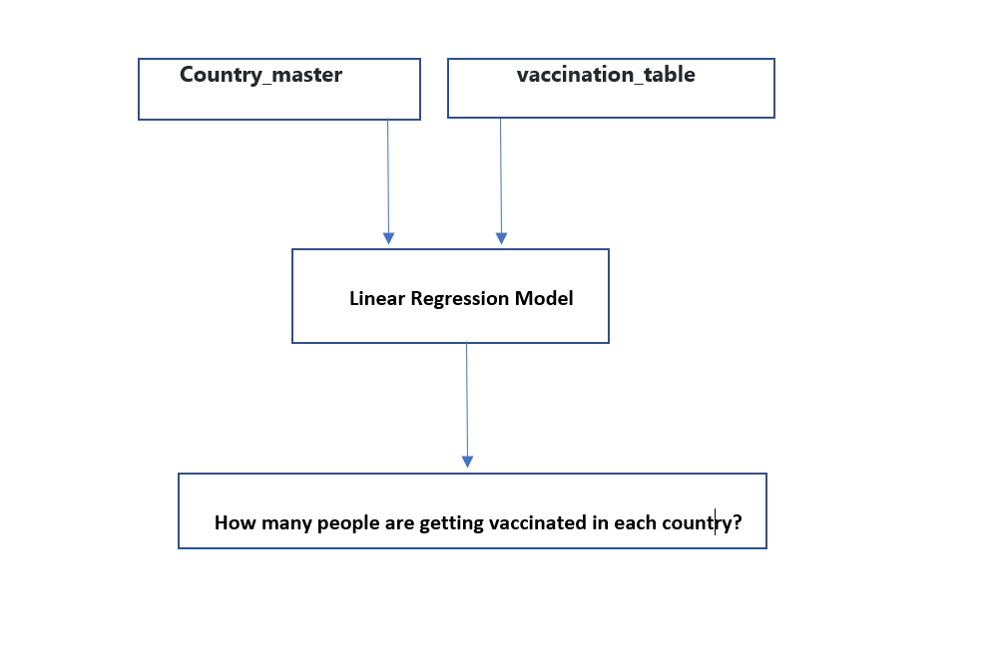

# Final Project Overview

Covid-19 is a global pandemic which has rocked our society to its core. It has caused massive fatality, increased unemployment across the nation, and shutdown travel in many parts of the world. We have decided that as a team we will be analyzing Covid-19 data because of its relevance in everyday life around us. It has affected our health, our jobs, and our way of life. Over the next few weeks, our team will be focused on recognizing and analyzing trends due to covid-19. The team members of this project include: Akshaya Kamble, Ray Hunt, Thomas Watson, and Tyler Engalla. Throughout the project we will be collaborting and working with one another to divide and conquer the full affects of this pandemic.

During this catastrope, we saw new daily confirmed patients into hospitals soaring as high as 18,000 new patients per day. Shortly after Covid-19 vaccinations became public, we began to see the number of covid confirmed patients fall significantly. The figure below shows the trend described. 

In the figure above, we see that the newly confirmed Covid-19 patients tend to slowly increase with time up until January of 2021. In Feburary of 2021, we see a remarkable change in the shift of newly confirmed covid-19 patients per day. The case count begins to decrease rapdily with time, up until a support line is reached. This support line is very difficult to go below, because of factors such as available vaccinations, limited medical and economical resources available, and social distancing regulations changing. Although this is not a value we tabulated, it is important because it helps us understand the general health outline for Covid-19 during the past few months.

## Getting Started
In the first week of the project, we had to make decisions on which technologies would be used to help us analyze Covid-19 data. 

- For the final project we have selected Supervised Machine learning, and decided that we will use a Linear Regression Model to help us analyze data from Covid Vaccinations and GDP of all countries. This model will help predict distributions of the vaccines in each country. As we have continuous data we will identify the relation between data and make predictions. A diagram of our linear regression thought process has been included below.

For the Linear Regression model we have imported a new Folder into our main Repository called Machine_Learning_1. This Linear Regression model takes in data from our provisional database and outputs labels for input data. This model lays a strong foundation for how we will move forward in the coming weeks.

- Using quickdatabasedesigns.com we created a conceptual design for our mockup database that includes two tables. The first is the master_country table that stores the following columns iso_code (primary key), country_name, population, gdp. The second table will store the vaccination data by country. The results of our conceptual diagram is shown below.

Several other questions we considered were as follows:
- Which tools are the best fit for our project?
- What tool will be used for each section?

1) Data Cleaning and Analysis -
Jupyter Notebook and the Pandas library will be used to clean the data and perform an exploratory analysis. Further analysis will be completed using Python.

2) Database Storage -
Postgres is the database we intend to use, and we will integrate Flask to display the data.

3) Machine Learning -
SciKitLearn is the ML library we'll be using to create a linear regression. We'll train our algorithm with a histocal dataset on Covid Vaccinations and GDP of all countries.

4) Dashboard -
In addition to using a Flask template, we will also integrate JavaScript, HTML, and CSS with the Plotly visualization library to build an interactive webpage. In addition, we may include the D3 library to visualize our data geographically.

## The Plan Ahead

In our project, we will be analyzing if a country's GDP affects the rate at which vaccinations are being adminsitered and when we expect each country to achieve full vaccination. 

We will be collecting data from Kaggle around vaccination rates and combining that with GDP data gathered to apply to our linear regression model to answer questions such as how GDP affects vaccination rates and when we expect full vaccination or immunity within a country.

## Communication Protocols

During this project, we will be using several forms of communication to make sure information is being administered to everyone.

1. Slack - Sharing files and seeking team approvals
2. Class breakout rooms - Discussing if the segment rubrics are met and checking progress for each member.
3. Direct messaging with one another to make sure we are on the same page.
4. Github merges into the main file, whilst always saving backups of the original
5. Seeking team members approval on changes to main file

## Data Source and Description

The data used in this project are included in the links below:

1. CDC Link: https://data.worldbank.org/indicator/NY.GDP.MKTP.CD?name_desc=false
2. Kaggle Data: https://www.kaggle.com/gpreda/covid-world-vaccination-progress
3. World Bank Data: https://data.worldbank.org/indicator/NY.GDP.MKTP.CD
4. Our World In Data: https://github.com/owid/covid-19-data/tree/master/public/data
5. UNDP data for hdi : http://hdr.undp.org/en/data

These datasets include information about GDP, vaccations given, total vaccinations, vaccinations per day, country administered, date, and much more. These five data sources have been chosen based off accuracy, their input type, and completeness. Descriptions of our files are included below.

1. country_gdp - This file from world bank has GDP for all countries starting from year 1960 to 2019, Since we are using covid-19 data for the project we will use gdp from the year 2019.

2. country_vaccinations - This file from kaggle has vaccination data for all countries along with dates,As the vaccinations are still 
in progress some countries have advanced towards some small percent of population considered fully vaccinated while some countries no not have any data.

3. world_population - This file from world bank has populations for all countries from year 1960 to 2019. As per project requirements we have used data only for the year 2019.This data is added to the gdp data file

4. human_dev_index - This file from UNITED NATIONS DEVELOPMENT PROGRAMME has human development index(HDI) for all countries along with Human Development Type which are required for the project

5. Infection_Data - This file from github repository has updated data from Our World in Data.This file has data about the infections rates,deaths, new case,hospitalization rate, testing dates for different countries.We have filtered the dataset as per project requirements and included data like total cases and total deaths. 

## Questions we Hope to Answer

Given our strict timeline on this Covid-19 analysis, we would like to analyze how certain attributes such as age, Gross Domestic Product (GDP), Human Development Index (HDI), and population directly impact the spread of Covid-19. If time allows, we would also be interesting in creating a model to help us predict the spread of Covid-19 in the future. In addition, by the end of the project our visuals should be extremely user friendly and portray an effective message.

## Description of Data Exploration Phase

1.Importing data from websites in csv and excel formats 
2. Cleaning data in Jupyter notebook using the following methods
a. Checking Data Types
b. Replace NaN by 0
	c. Removing Nan
	d. Outlier detection with help of scatter plot
	e. Editing column names by removing spaces 
	f. Changing column names to match the SQL schema
	g. Filter required columns as some tables contain irrelevant data for project

3. Making Database connection to Postgres and sending the cleaned Data Frames from Jupyter notebook to Postgres
4. Joining tables in postgres to create master data files
5. Making database connection to Postgres to import the joined tables in Jupyter notebook as new DataFrame.
6. Using the Data Frame for machine learning 

