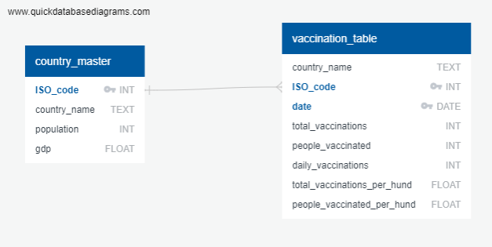

# Final Project Overview

Covid-19 is a global pandemic which has rocked our society to its core. It has caused massive fatality, increased unemployment across the nation, and shutdown travel in many parts of the world. We have decided that as a team we will be analyzing Covid-19 data because of its relevance in everyday life around us. Over the next few weeks, our team will be focused on recognizing and analyzing trends due to covid-19. The team members of this project include: Akshaya Kamble, Ray Hunt, Thomas Watson, and Tyler Engalla. Throughout the project we will be collaborting and working with one another to divide and conquer the full affects of this pandemic.

During this catastrope, we saw new daily confirmed patients into hospitals soaring as high as 18,000 new patients per day. Shortly after Covid-19 vaccinations became public, we began to see the number of covid confirmed patients fall significantly. The figure below shows the trend described. 

In the figure above, we see that the newly confirmed Covid-19 patients tend to slowly increase with time up until January of 2021. In Feburary of 2021, we see a remarkable change in the shift of newly confirmed covid-19 patients per day. The case count begins to decrease rapdily with time, up until a support line is reached. This support line is very difficult to go below, because of factors such as available vaccinations, limited medical and economical resources available, and social distancing regulations changing. Although this is not a value we tabulated, it is important because it helps us understand the general health outline for Covid-19 during the past few months.

## Task Delegation and Work
In the first week of the project, we had to make decisions on which members would be responsible for certain parts of the projects. As this was a group effort, many of often worked together to come to these conclusions. For week one, the following members were given these roles:

### 1) Square Role - Thomas Watson
- This member is in charge of setting up the repository for the team to use. In addition, this member will ensure that each of the four members has their our branch to test and push changes to the main branch.

Square Role Work Done

- This member set up the GitHub repository and got everyone to make their own branch. In addition, this role was in charge of compiling the report findings in the main read.me branch. In addition, this role made sure that all images, links, and notes from each individual branch were properly pushed into the report.

### 2) Triangle Role - Akshaya Kamble 
- This team member will be responsible for creating a machine learning model. We will consider which model to choose, how to train the model, the accuracy of the model, and how it works.

Triangle Role Work Done

- For the final project we have selected Supervised Machine learning, and we will use a Linear Regression Model to help us analyze data from Covid Vaccinations and GDP of all countries. This model will help predict distributions of the vaccines in each country. As we have continuous data we will identify the relation between data and make predictions. A diagram of or linear regression thought process has been included below.

### 3) Circle Role - Ray Hunt
- This team member will be in charge of the mockup database. We will be creating an SQL-database, including an ERD of the database and a document showing how it is intergated in the database and its conection with the code.

Circle Role Work Done

- Using quickdatabasedesigns.com we created a conceptual design that includes two tables. The first is the master_country table that stores the following columns iso_code (primary key), country_name, population, gdp. The second table will store the vaccination data by country. The results of our conceptual diagram is shown below.

### 4) X Role - Tyler Engalla
- This team member will focus on the technology side of the project. They will consider the best tools to use for the project, what will be used in each section, and how each of these functions will flow together smoothly to provide a crisp result.

X Role Work Done

For this role, there are several questions we must consider:
- Which tools are the best fit for our project?
- What tool will be used for each section?

1) Data Cleaning and Analysis
Jupyter Notebook and the Pandas library will be used to clean the data and perform an exploratory analysis. Further analysis will be completed using Python.

2) Database Storage
Postgres is the database we intend to use, and we will integrate Flask to display the data.

3) Machine Learning
SciKitLearn is the ML library we'll be using to create a linear regression. We'll train our algorithm with a histocal dataset on Covid Vaccinations and GDP of all countries.

4) Dashboard
In addition to using a Flask template, we will also integrate JavaScript, HTML, and CSS with the Plotly visualization library to build an interactive webpage. In addition, we may include the D3 library to visualize our data geographically.

## The Plan Ahead

In our project, we will be analyzing if a country's GDP affects the rate at which vaccinations are being adminsitered and when we expect each country to achieve full vaccination. 

We will be collecting data from Kaggle around vaccination rates and combining that with GDP data gathered to apply to our linear regression model to answer the above questions.  

GDP Data: https://data.worldbank.org/indicator/NY.GDP.MKTP.CD?name_desc=false

Covid Vaccination Rate Data: https://www.kaggle.com/gpreda/covid-world-vaccination-progress

